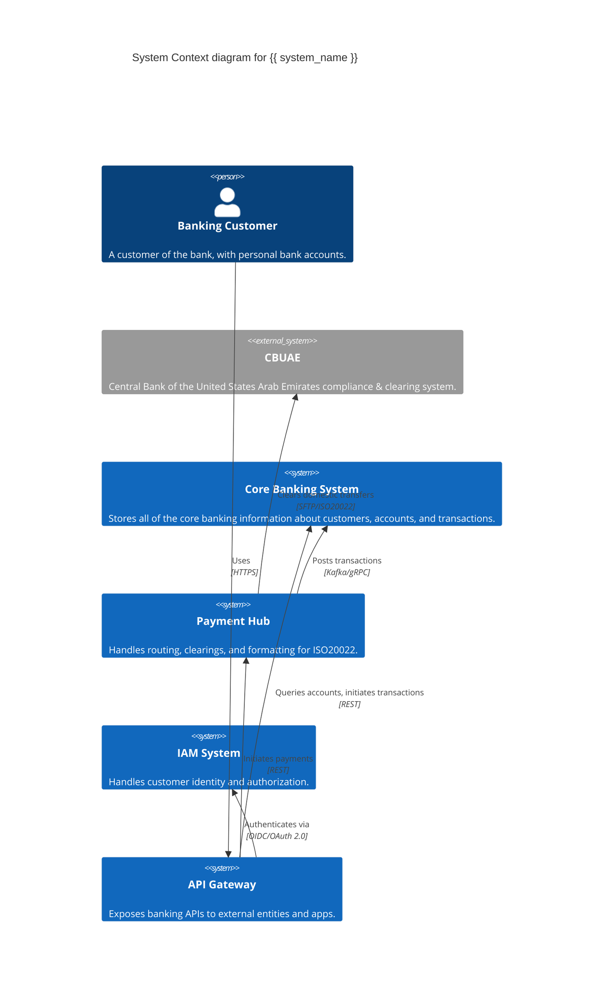

```mermaid
---
title: "System Context: {{ system_name }}"
config:
  metadata:
    artifact_id: "{{ artifact_id }}"
    generated_by: "{{ generated_by }}"
    timestamp: "{{ timestamp }}"
---
C4Context
  title System Context diagram for {{ system_name }}
  
  Person(customer, "Banking Customer", "A customer of the bank, with personal bank accounts.")
  
  System_Ext(cbuae, "CBUAE", "Central Bank of the United States Arab Emirates compliance & clearing system.")
  System(core_banking, "Core Banking System", "Stores all of the core banking information about customers, accounts, and transactions.")
  System(payment_hub, "Payment Hub", "Handles routing, clearings, and formatting for ISO20022.")
  System(iam, "IAM System", "Handles customer identity and authorization.")
  System(api_gw, "API Gateway", "Exposes banking APIs to external entities and apps.")

  Rel(customer, api_gw, "Uses", "HTTPS")
  Rel(api_gw, iam, "Authenticates via", "OIDC/OAuth 2.0")
  Rel(api_gw, core_banking, "Queries accounts, initiates transactions", "REST")
  Rel(api_gw, payment_hub, "Initiates payments", "REST")
  
  Rel(payment_hub, core_banking, "Posts transactions", "Kafka/gRPC")
  Rel(payment_hub, cbuae, "Clears domestic transfers", "SFTP/ISO20022")
```
