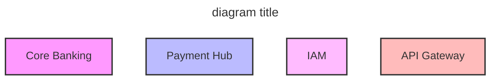

# Canonical Mermaid Definitions
## Core Banking System

```mermaid
---
title: "diagram title"
config:
  metadata:
    artifact_id: "{{ artifact_id }}"
    generated_by: "{{ generated_by }}"
    timestamp: "{{ timestamp }}"
---
flowchart TD
  classDef coreBank fill:#f9f,stroke:#333,stroke-width:2px;
  classDef paymentHub fill:#bbf,stroke:#333,stroke-width:2px;
  classDef iam fill:#fbf,stroke:#333,stroke-width:2px;
  classDef apiGateway fill:#fbb,stroke:#333,stroke-width:2px;

  B[Core Banking]:::coreBank
  P[Payment Hub]:::paymentHub
  I[IAM]:::iam
  A[API Gateway]:::apiGateway
```
