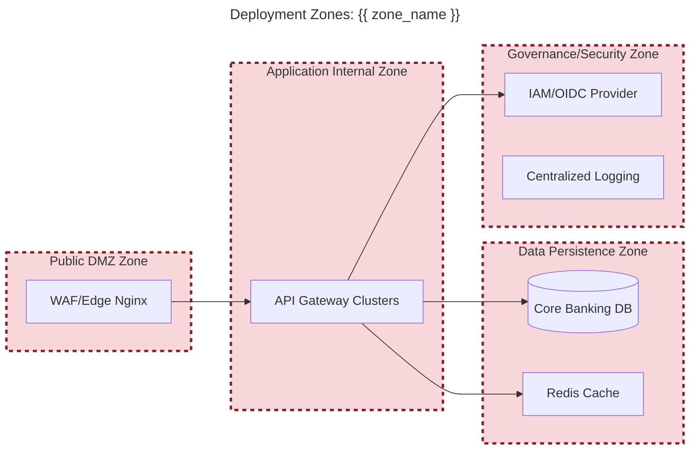

```mermaid
---
title: "Deployment Zones: {{ zone_name }}"
config:
  metadata:
    artifact_id: "{{ artifact_id }}"
    generated_by: "{{ generated_by }}"
    timestamp: "{{ timestamp }}"
---
flowchart LR
  subgraph DMZ [Public DMZ Zone]
    NGINX[WAF/Edge Nginx]
  end

  subgraph App [Application Internal Zone]
    API[API Gateway Clusters]
  end
  
  subgraph Data [Data Persistence Zone]
    DB[(Core Banking DB)]
    CACHE[Redis Cache]
  end
  
  subgraph Governance [Governance/Security Zone]
    IAM[IAM/OIDC Provider]
    LOG[Centralized Logging]
  end

  NGINX --> API
  API --> IAM
  API --> DB
  API --> CACHE
  
  classDef cbuaeZone fill:#f8d7da,stroke:#842029,stroke-width:3px,stroke-dasharray: 5 5;
  
  DMZ:::cbuaeZone
  App:::cbuaeZone
  Data:::cbuaeZone
  Governance:::cbuaeZone
```

%% data_sovereignty: onshore %%
