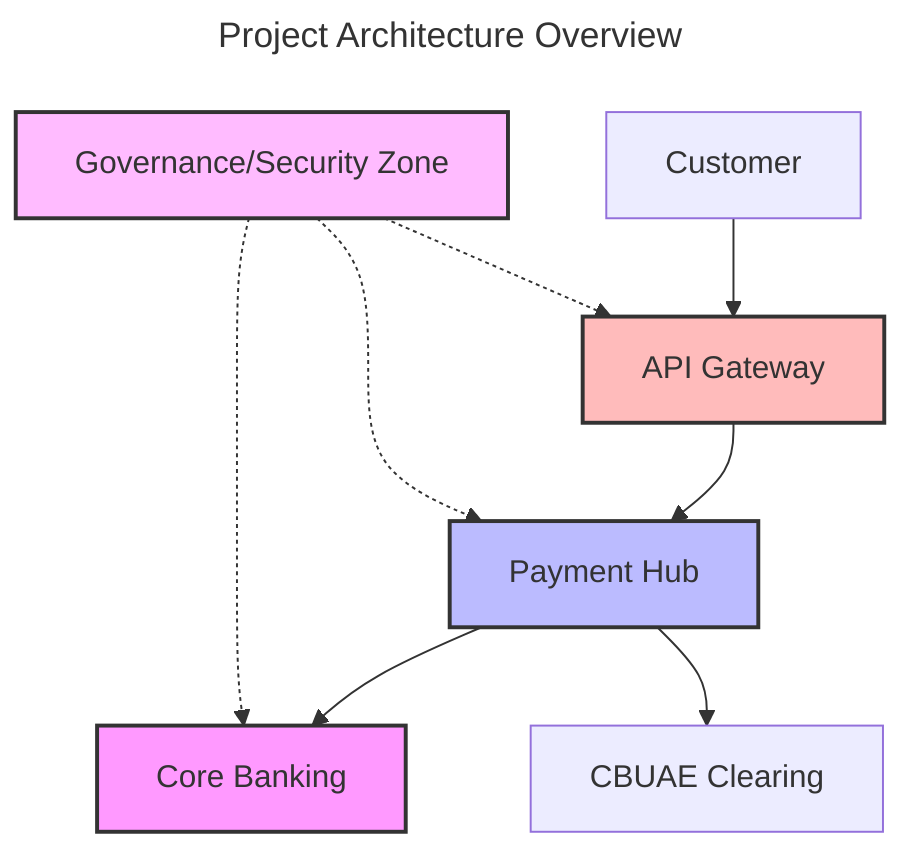

```mermaid
---
title: "Project Architecture Overview"
config:
  metadata:
    artifact_id: "arch-overview-001"
    generated_by: "claude-code"
    timestamp: "2026-08-19"
---
flowchart TD
  classDef coreBank fill:#f9f,stroke:#333,stroke-width:2px;
  classDef paymentHub fill:#bbf,stroke:#333,stroke-width:2px;
  classDef iam fill:#fbf,stroke:#333,stroke-width:2px;
  classDef apiGateway fill:#fbb,stroke:#333,stroke-width:2px;

  %% Nodes
  C[Customer]
  AG[API Gateway]:::apiGateway
  PH[Payment Hub]:::paymentHub
  CB[Core Banking]:::coreBank
  CLR[CBUAE Clearing]
  G[Governance/Security Zone]:::iam

  %% Relationships
  C --> AG
  AG --> PH
  PH --> CB
  PH --> CLR
  G -.-> AG
  G -.-> PH
  G -.-> CB
```
%% data_sovereignty: onshore %%
