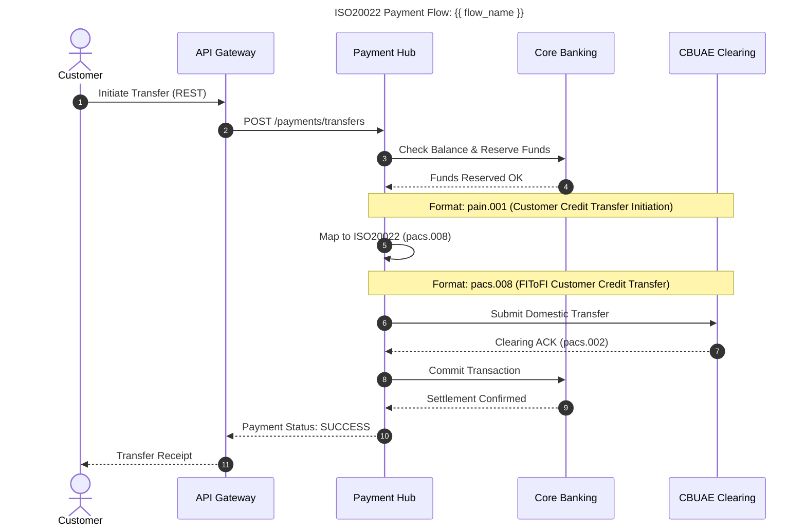

```mermaid
---
title: "ISO20022 Payment Flow: {{ flow_name }}"
config:
  metadata:
    artifact_id: "{{ artifact_id }}"
    generated_by: "{{ generated_by }}"
    timestamp: "{{ timestamp }}"
---
sequenceDiagram
    autonumber
    
    actor Cust as Customer
    participant GW as API Gateway
    participant PH as Payment Hub
    participant CBS as Core Banking
    participant CLR as CBUAE Clearing

    Cust->>GW: Initiate Transfer (REST)
    GW->>PH: POST /payments/transfers
    PH->>CBS: Check Balance & Reserve Funds
    CBS-->>PH: Funds Reserved OK
    
    Note over PH,CLR: Format: pain.001 (Customer Credit Transfer Initiation)
    PH->>PH: Map to ISO20022 (pacs.008)
    
    Note over PH,CLR: Format: pacs.008 (FIToFI Customer Credit Transfer)
    PH->>CLR: Submit Domestic Transfer
    CLR-->>PH: Clearing ACK (pacs.002)
    
    PH->>CBS: Commit Transaction
    CBS-->>PH: Settlement Confirmed
    PH-->>GW: Payment Status: SUCCESS
    GW-->>Cust: Transfer Receipt
```
