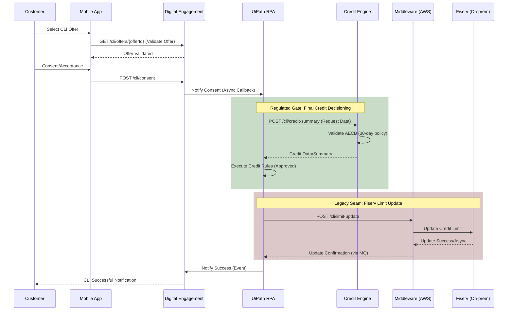
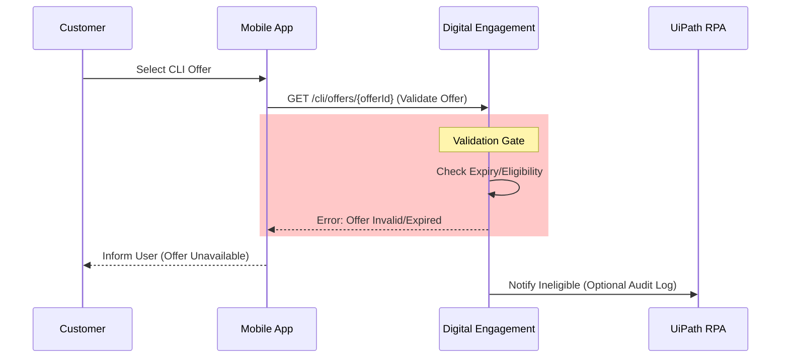

# Sequence Fragment: Happy Path - CLI Acceptance & Processing

```mermaid
sequenceDiagram
    participant User as Customer
    participant Mobile as Mobile App
    participant DEngage as Digital Engagement
    participant RPA as UiPath RPA
    participant CE as Credit Engine
    participant MW as Middleware (AWS)
    participant Fiserv as Fiserv (On-prem)

    User->>Mobile: Select CLI Offer
    Mobile->>DEngage: GET /cli/offers/{offerId} (Validate Offer)
    DEngage-->>Mobile: Offer Validated
    User->>Mobile: Consent/Acceptance
    Mobile->>DEngage: POST /cli/consent
    DEngage->>RPA: Notify Consent (Async Callback)
    
    rect rgb(200, 220, 200)
    Note over RPA, CE: Regulated Gate: Final Credit Decisioning
    RPA->>CE: POST /cli/credit-summary (Request Data)
    CE->>CE: Validate AECB (30-day policy)
    CE-->>RPA: Credit Data/Summary
    RPA->>RPA: Execute Credit Rules (Approved)
    end
    
    rect rgb(220, 200, 200)
    Note over RPA, Fiserv: Legacy Seam: Fiserv Limit Update
    RPA->>MW: POST /cli/limit-update
    MW->>Fiserv: Update Credit Limit
    Fiserv-->>MW: Update Success/Async
    MW-->>RPA: Update Confirmation (via MQ)
    end

    RPA->>DEngage: Notify Success (Event)
    DEngage-->>User: CLI Successful Notification
```

# Sequence Fragment: Exception Path - Offer Expired / Ineligible

```mermaid
sequenceDiagram
    participant User as Customer
    participant Mobile as Mobile App
    participant DEngage as Digital Engagement
    participant RPA as UiPath RPA

    User->>Mobile: Select CLI Offer
    Mobile->>DEngage: GET /cli/offers/{offerId} (Validate Offer)
    
    rect rgb(255, 200, 200)
    Note over DEngage: Validation Gate
    DEngage->>DEngage: Check Expiry/Eligibility
    DEngage-->>Mobile: Error: Offer Invalid/Expired
    end
    
    Mobile-->>User: Inform User (Offer Unavailable)
    DEngage->>RPA: Notify Ineligible (Optional Audit Log)
```
